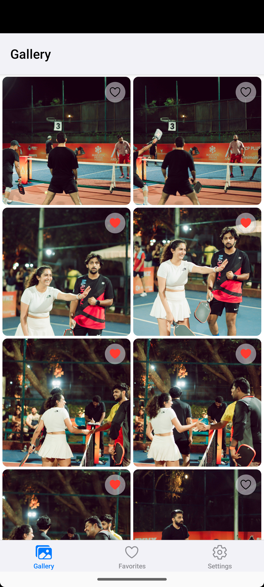
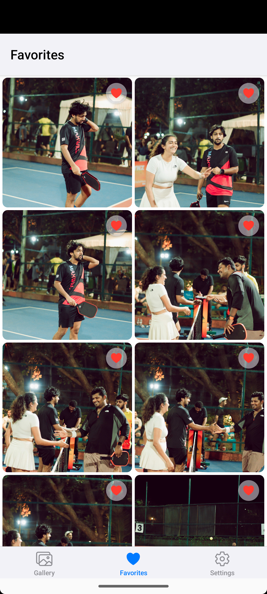
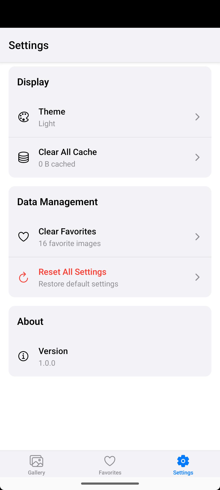
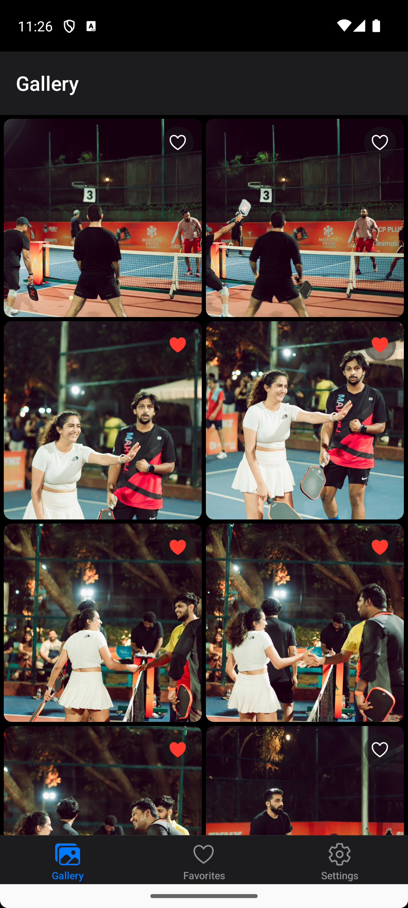
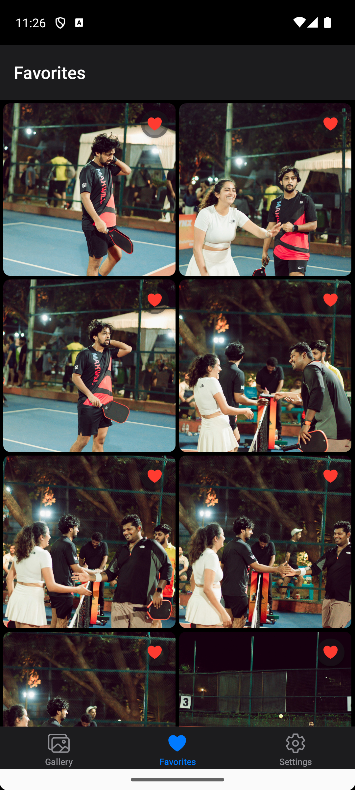

# Gallery App
A beautiful React Native gallery application with image viewing, favorites management, and smooth navigation.

## Features
- 📱 **Image Gallery**: Browse through a collection of images in an elegant grid layout
- ❤️ **Favorites**: Add images to favorites and manage your collection
- 🔍 **Image Viewer**: Full-screen image viewing with zoom, pan, and gesture controls
- 🌓 **Theme Support**: Light and dark theme modes
- 📱 **Cross-Platform**: Works on both iOS and Android
- 🎯 **Performance Optimized**: Memory-efficient image loading and caching

## Screenshots
### Light Theme
<table>
  <tr>
    <td></td>
    <td></td>
    <td></td>
  </tr>
</table>

### Dark Theme
<table>
  <tr>
    <td></td>
    <td></td>
    <td></td>
  </tr>
</table>

## Prerequisites
Before running this project, make sure you have the following installed:
- **Node.js** (v16 or later)
- **npm** or **yarn**
- **React Native CLI** or **Expo CLI**
- **Android Studio** (for Android development)
- **Xcode** (for iOS development, macOS only)

### For Expo CLI:
```bash
npm install -g @expo/cli
```

## Installation & Setup

### 1. Clone the repository
```bash
git clone https://github.com/boyidapuvivek/PhotoGalleryApp.git
cd PhotoGalleryApp
```

### 2. Install dependencies
```bash
npm install
# or
yarn install
```

### 3. Environment Configuration
Create a `.env` file in the root directory using the provided template:
```bash
cp .env
```

Edit the `.env` file with your configuration:
```bash
API=<Your API>
```

#### Android Setup:
Make sure Android Studio is installed and configured with an Android Virtual Device (AVD) or connect a physical device with USB debugging enabled.

## Running the Application

### Development Mode

#### For iOS:
```bash
# Using Expo
npx expo run:ios
```

#### For Android:
```bash
# Using Expo
npx expo run:android
```

#### Using Expo (if applicable):
```bash
# Start Expo development server
npx expo start

# Then scan QR code with Expo Go app or press 'a' for Android, 'i' for iOS
```

## Project Structure
```
src/
├── components/
│   ├── gallery/
│   │   ├── ImageGrid.tsx          # Main grid component with virtualization
│   │   └── ImageSkeleton.tsx      # Loading placeholder component
│   ├── viewer/
│   │   ├── ImageViewer.tsx        # Full-screen image viewer
│   │   └── ImageViewerControls.tsx # Zoom, pan, share controls
│   └── common/
│       ├── ErrorBoundary.tsx      # Error handling wrapper
│       ├── LoadingSpinner.tsx     # Reusable loading component
│       └── EmptyState.tsx         # Empty state illustrations
├── screens/
│   ├── HomeScreen.tsx             # Main gallery screen
│   ├── FavoritesScreen.tsx        # Favorites collection
│   └── ImageViewerScreen.tsx      # Modal image viewer
├── hooks/
│   ├── useImageGrid.ts            # Grid virtualization logic
│   └── useFavorites.ts            # Favorites management
├── store/
│   ├── galleryStore.ts            # Image data & grid state
│   ├── favoritesStore.ts          # Favorites management
│   └── settingsStore.ts           # Theme & app settings
├── types/
│   ├── gallery.ts                 # Image & gallery types
│   └── navigation.ts              # Navigation parameter types
├── utils/
│   └── constants.ts               # App constants & themes
└── services/
    └── storage/
        └── mmkvStorage.ts         # Fast local storage service
```

## Key Dependencies
- **React Native**: Core framework
- **React Navigation**: Navigation management
- **Expo Image**: Optimized image component with caching
- **React Native Gesture Handler**: Gesture controls
- **React Native Reanimated**: Smooth animations and native thread operations
- **React Native MMKV**: Fast key-value storage
- **Zustand**: Lightweight state management
- **React Native Safe Area Context**: Safe area handling
